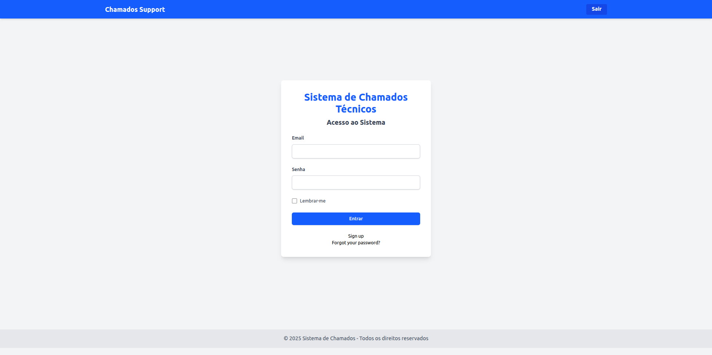
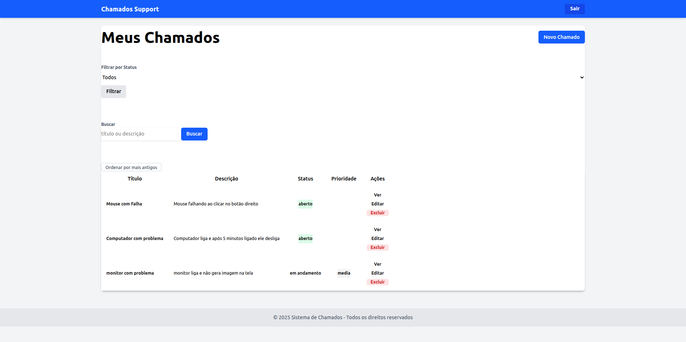
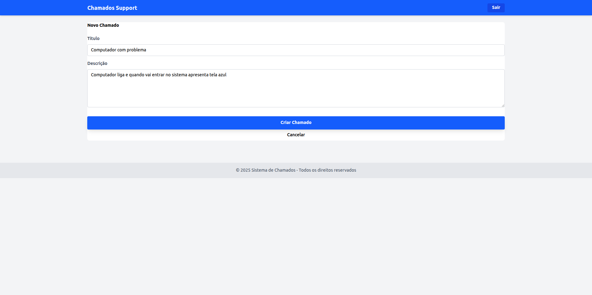
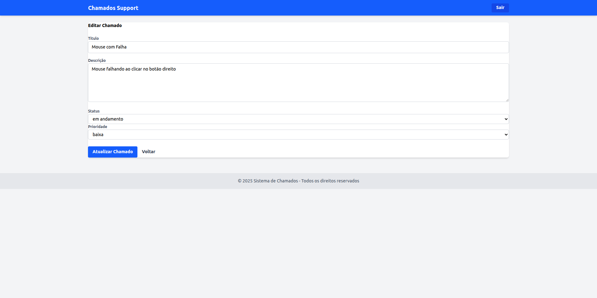

# Chamados Support

Sistema web para controle e gerenciamento de chamados técnicos, desenvolvido com Ruby on Rails.

## ✨ Funcionalidades

- Autenticação de usuários com Devise  
- Cadastro, edição, exclusão e visualização de chamados  
- Filtros por status e busca por título/descrição  
- Interface estilizada com Tailwind CSS  
- Ordenação por data de criação

## 🔧 Tecnologias Utilizadas

- **Ruby** 3.x  
- **Rails** 8.0.2  
- **SQLite** – Banco de dados relacional  
- **Devise** – Autenticação de usuários  
- **Tailwind CSS** – Estilização da interface  
- **Importmap** – Gerenciamento de dependências JavaScript (sem Webpacker)  
- **Turbo & Stimulus** – Ferramentas do Hotwire para interatividade sem JavaScript personalizado  
- **ESBuild** (opcional, caso deseje adicionar JS moderno futuramente)

## ✅ Pré-requisitos

Antes de instalar e executar o projeto, certifique-se de ter os seguintes softwares instalados na sua máquina:

- [Ruby](https://www.ruby-lang.org/pt/) (versão 3.2.2)  
- [Rails](https://rubyonrails.org/) (versão 8.0.2)  
- [SQLite](https://www.sqlite.org/)  
- [Node.js](https://nodejs.org/) – Necessário para compilar assets modernos  
- [Yarn](https://yarnpkg.com/) – Gerenciador de pacotes JS  
- Bundler (`gem install bundler`)

## 🚀 Instalação

1. Clone o repositório:

```bash
git clone https://github.com/devAdemarNeto/chamados_support.git
cd chamados_support
```

2. Instale as dependências Ruby:

```bash
bundle install
```

3. Configure o banco de dados:

```bash
rails db:create
rails db:migrate
```

4. (Opcional) Instale dependências JS caso use bundler como esbuild:

```bash
yarn install
```

5. Execute o servidor Rails:

```bash
bin/dev
```

> Isso iniciará o servidor local e o Tailwind via importmap.

6. Acesse o sistema em:

[http://localhost:3000](http://localhost:3000)

## 🔐 Autenticação

A autenticação foi implementada com **Devise**. Após subir o sistema, crie manualmente um usuário administrador para login:

```bash
rails console
User.create!(email: 'admin@exemplo.com', password: 'senha123', password_confirmation: 'senha123')
```

## 🧪 Testes

Funcionalidade de testes ainda não implementada. Em breve.

## 🗂 Estrutura do Projeto

- `app/models/` – Modelos (User, Ticket)  
- `app/views/` – Views com Tailwind CSS  
- `app/controllers/` – Lógica de controle  
- `app/assets/` – Imagens e outros arquivos estáticos  
- `config/routes.rb` – Arquivo de rotas

## 📦 Gems e Dependências

- [`devise`](https://github.com/heartcombo/devise)  
- [`tailwindcss-rails`](https://github.com/rails/tailwindcss-rails)  
- [`pg`](https://rubygems.org/gems/pg)  
- [`importmap-rails`](https://github.com/rails/importmap-rails)  
- [`turbo-rails`](https://github.com/hotwired/turbo-rails)  
- [`stimulus-rails`](https://github.com/hotwired/stimulus-rails)

## 📸 Screenshots

### Tela de Login


### Lista de Chamados


### Novo Chamado


### Editar Chamado


## 📄 Licença

Este projeto está licenciado sob a licença MIT - veja o arquivo [LICENSE](LICENSE) para mais detalhes.

---

Desenvolvido por [Ademar Neto](https://github.com/devAdemarNeto) 🚀
